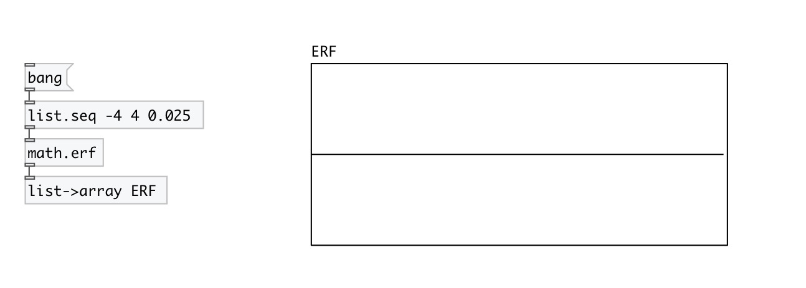

[< reference home](index.html)
---

# math.erf

error function

---

In statistics, for non-negative values of x, the error function has the following
            interpretation:
for a random variable Y that is normally distributed with mean 0 and variance 1/2,
            erf x is the probability that Y falls in the range [−x, x]
 

---

---
arguments:

---
properties:

---
see also: 

