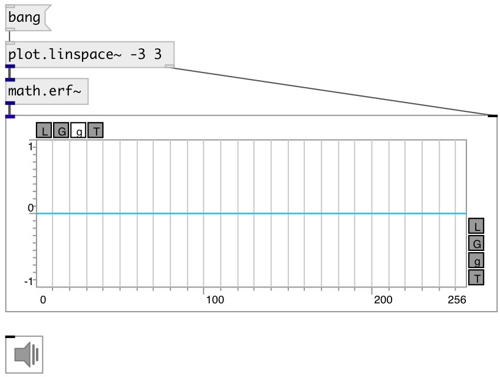

[index](index.html) :: [math](category_math.html)
---

# math.erf~

###### error function for signals

*available since version:* 0.9

---

## information
In statistics, for non-negative values of x, the error function has the following
            interpretation:
for a random variable Y that is normally distributed with mean 0 and variance 1/2,
            erf x is the probability that Y falls in the range [−x, x]

## inlets:

* input signal 
__type:__ audio 

## outlets:

* output signal
__type:__ audio 

## keywords:

[math](keywords/math.html)
[error](keywords/error.html)
[gauss](keywords/gauss.html)

**See also:**
[\[math.erf\]](math.erf.html)

**Authors:** Serge Poltavsky

**License:** GPL3 or later

