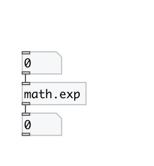

[< reference home](index.html)
---

# math.exp

exponential functions

---

The exp() function computes e**x, the base-e exponential of x.
If x is nearly zero, then the common expression exp(x) - 1.0 will suffer from
            catastrophic cancellation and the result will have little or no precision.
Special values:
exp(+-0) return 1.
exp(-infinity) return +0.
exp(+infinity) return +infinity.
For all these functions, a range error occurs if the magnitude of x is too
            large.
 

---

---
arguments:

---
properties:

---
see also: 

