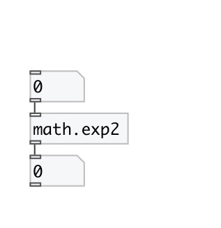

[< reference home](index.html)
---

# math.exp2

exponential functions

---

The exp2() function computes 2**x, the base-2 exponential of x.
Special values:
exp(+-0) return 1.
exp(-infinity) return +0.
exp(+infinity) return +infinity.
For all these functions, a range error occurs if the magnitude of x is too
            large.
 

---

---
arguments:

---
properties:

---
see also: 

