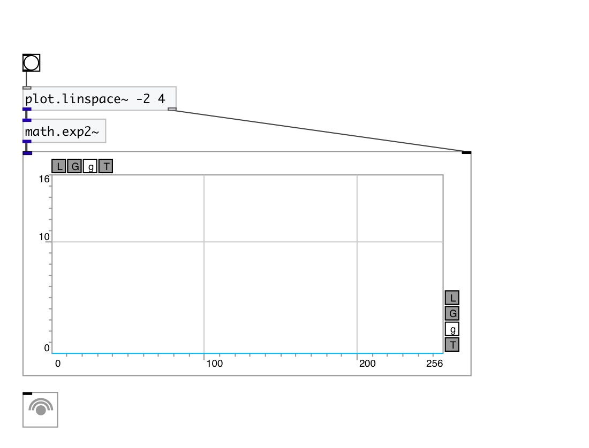

[< reference home](index.html)
---

# math.exp2~

base-2 exponential for signal

---

The exp2() function computes 2**x, the base-2 exponential of x.
Special values:
exp2(+-0) return 1.
exp2(-infinity) return +0.
exp2(+infinity) return +infinity.
 

---

---
arguments:

---
properties:

---
see also: 

