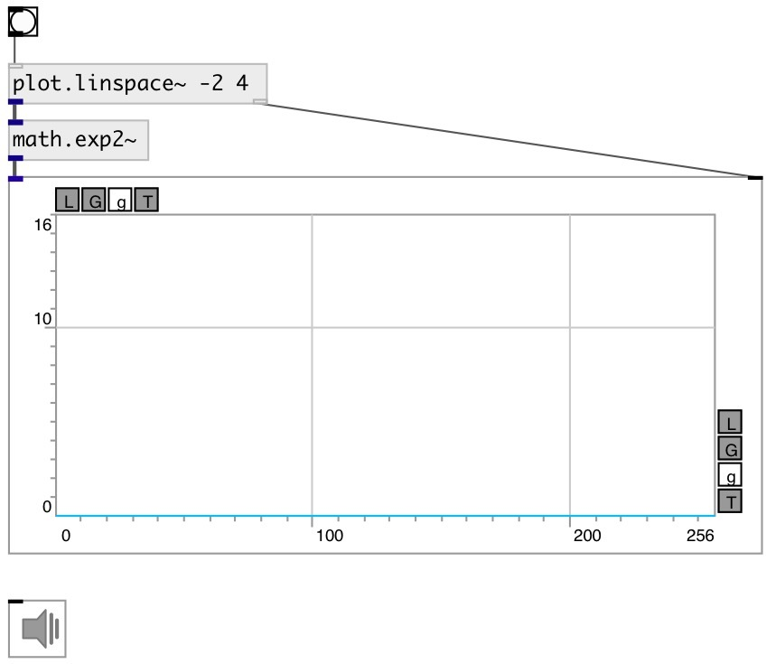

[index](index.html) :: [math](category_math.html)
---

# math.exp2~

###### base-2 exponential for signal

*available since version:* 0.9

---

## information
The exp2() function computes 2**x, the base-2 exponential of x. Special values: exp2(+-0) return 1. exp2(-infinity) return +0. exp2(+infinity) return +infinity.

## inlets:

* input signal 
_type:_ audio

## outlets:

* output signal 
_type:_ audio

## keywords:

[math](keywords/math.html)
[exp2](keywords/exp2.html)

**See also:**
[\[math.log2~\]](math.log2~.html)

**Authors:** Serge Poltavsky

**License:** GPL3 or later

