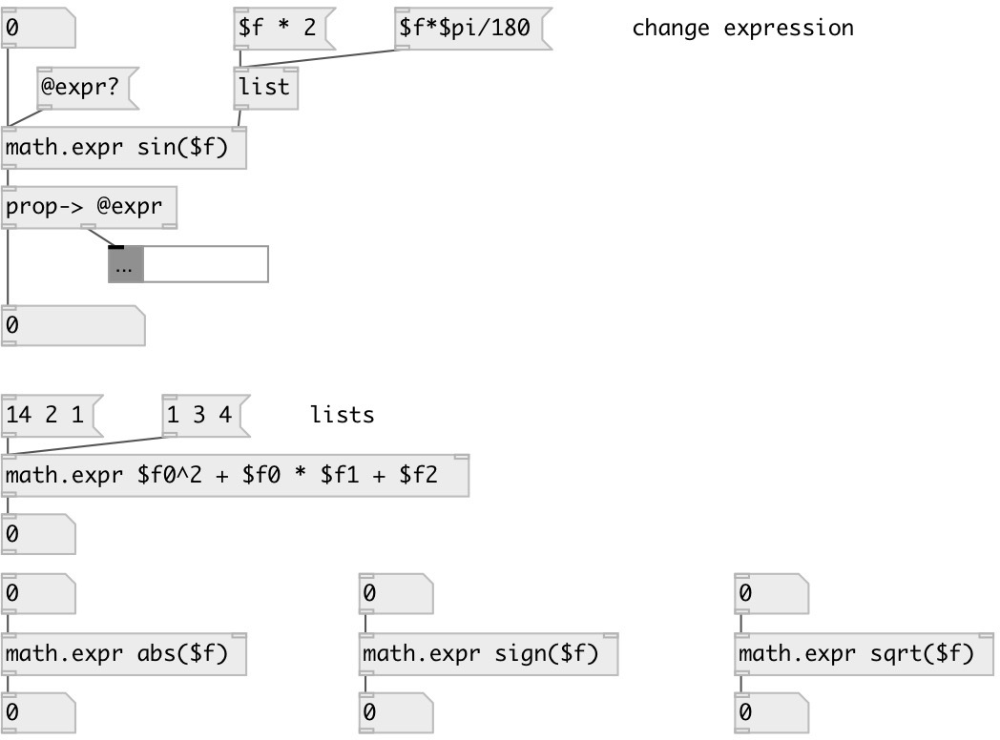

[index](index.html) :: [math](category_math.html)
---

# math.expr

###### dynamic [expr]

*available since version:* 0.6

---

## information
Operators: +, -, *, /, %, &lt;, &lt;=, &gt;=, &gt;, ==, != Functions: sin(), cos(), tan(), atan(), sqrt(), ln(), log2(), log10(), exp(), round(), ceil(), float(), fact(), min(), max(), sign(), abs() Constants: $pi, $e Variables: $f, $f0, $f1 ... $f9 Array access: array1[$f]

## arguments:

* **EXPR**
expression 
_type:_ list 

## properties:

* **@expr** 
Get/set expression 
_type:_ list 

## inlets:

* input value (referenced as $f0 or $f in expression) 
_type:_ control
* change expression 
_type:_ control

## outlets:

* calculated expression 
_type:_ control

## keywords:

[math](keywords/math.html)
[expr](keywords/expr.html)

**Authors:** Serge Poltavsky

**License:** GPL3 or later

