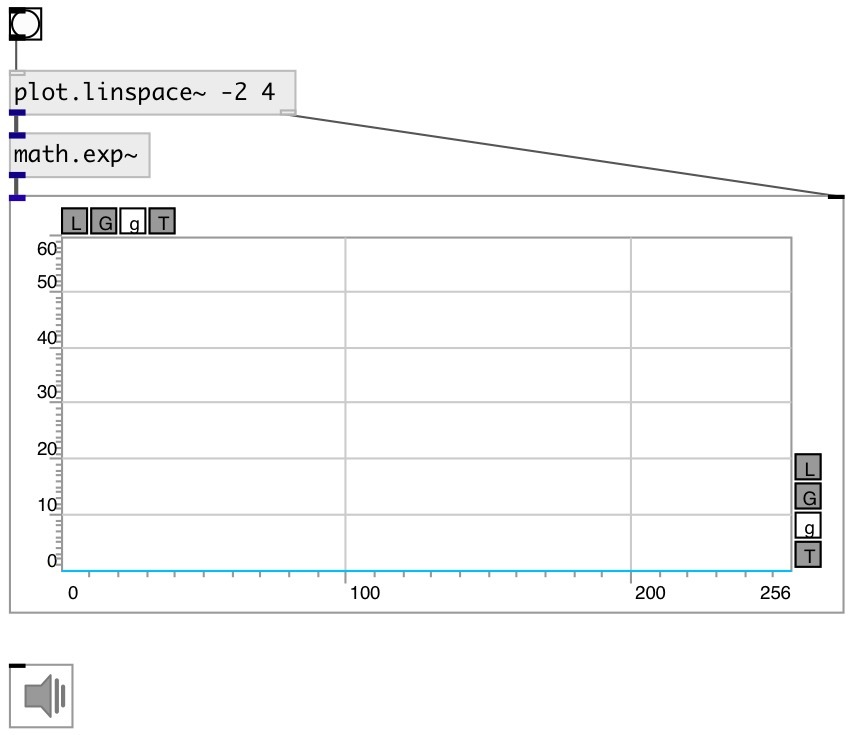

[index](index.html) :: [math](category_math.html)
---

# math.exp~

###### base-e exponential for signal

*available since version:* 0.9

---

## inlets:

* input signal 
__type:__ audio 

## outlets:

* output signal
__type:__ audio 

## keywords:

[math](keywords/math.html)
[exp2](keywords/exp2.html)

**See also:**
[\[math.log~\]](math.log~.html)
[\[math.exp2~\]](math.exp2~.html)

**Authors:** Serge Poltavsky

**License:** GPL3 or later

