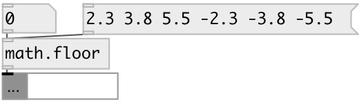

[index](index.html) :: [math](category_math.html)
---

# math.floor

###### round to largest integral value not greater than x

*available since version:* 0.1

---

## information
The floor() functions return the largest integral value less than or equal to x. Special values: floor(+-0) returns +-0. floor(+-infinity) returns +-infinity.

## inlets:

* input value 
_type:_ control

## outlets:

* result value 
_type:_ control

## keywords:

[math](keywords/math.html)
[floor](keywords/floor.html)

**See also:**
[\[math.ceil\]](math.ceil.html)
[\[math.round\]](math.round.html)
[\[math.trunc\]](math.trunc.html)

**Authors:** Serge Poltavsky

**License:** GPL3 or later

