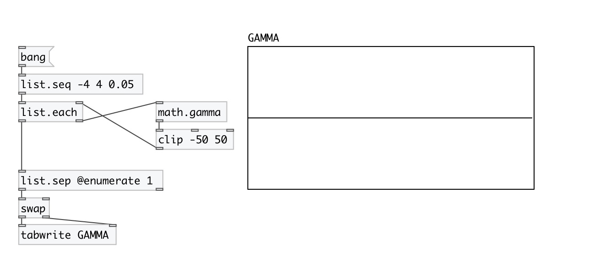

[< reference home](index.html)
---

# math.gamma

gamma function

---

Extension of factorial function to real numbers
For any positive integer n, Γ(n) = (n−1)!
 

---

---
arguments:

---
properties:

---
see also: 

