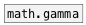

[< reference home](ceammc_lib.html)
---

# math.gamma~


gamma function for floating point signals

```


[bang(
|
[plot.linspace~ -4 8 400 #a]
|
[math.gamma~]
|
[ui.plot~ @xlabels 1 @ylabels 1 @ymin -20 @ymax 40 @size 400 170 @ymin_ticks 0 #b]


[ui.dsp~]
[X a:1->b:1]

            
```

---
arguments:


---
properties:


---
see also:<br>
[](math.gamma.html)
[](math.lgamma~.html)
