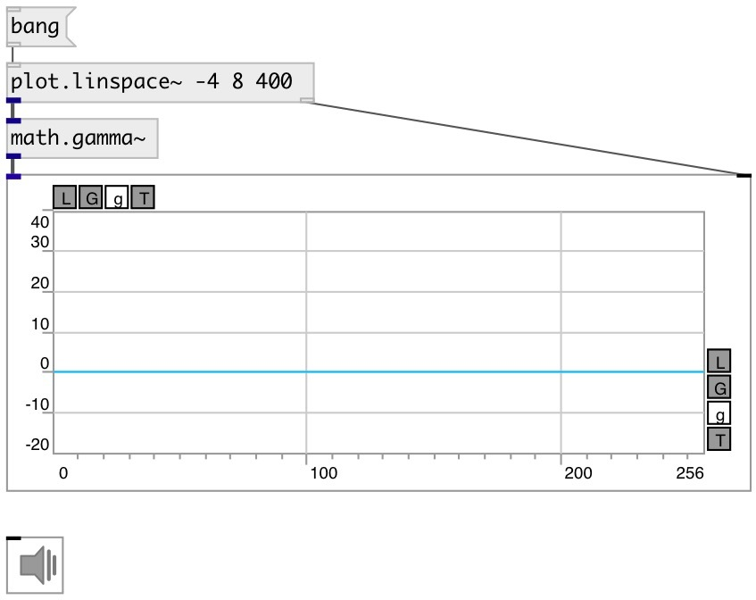

[index](index.html) :: [math](category_math.html)
---

# math.gamma~

###### gamma function for floating point signals

*available since version:* 0.9

---

## information
Extension of factorial function to real numbers For any positive integer n, Γ(n) = (n−1)!

## inlets:

* input signal 
_type:_ audio

## outlets:

* output signal 
_type:_ audio

## keywords:

[math](keywords/math.html)
[gamma](keywords/gamma.html)
[factorial](keywords/factorial.html)

**See also:**
[\[math.gamma\]](math.gamma.html)
[\[math.lgamma~\]](math.lgamma~.html)

**Authors:** Serge Poltavsky

**License:** GPL3 or later

