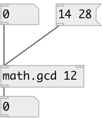

[index](index.html) :: [math](category_math.html)
---

# math.gcd

###### calculate greatest common divisor

*available since version:* 0.3

---

## arguments:

* **ARG2**
second argument 
__type:__ int 

## inlets:

* sets first argument and outputs calculated GCD value 
__type:__ control 
* sets second value 
__type:__ control 

## outlets:

* GCD value
__type:__ control 

## keywords:

[math](keywords/math.html)
[gcd](keywords/gcd.html)

**See also:**
[\[math.lcm\]](math.lcm.html)

**Authors:** Serge Poltavsky

**License:** GPL3 or later

