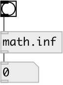

[index](index.html) :: [math](category_math.html)
---

# math.inf

###### output infinity value in the IEEE 754 standard

*available since version:* 0.1

---

## information
IEEE 754 floating point numbers can represent positive or negative infinity, and NaN (not a number). These three values arise from calculations whose result is undefined or cannot be represented accurately.

## inlets:

* outputs *inf* value 
_type:_ control

## outlets:

* output value 
_type:_ control

## keywords:

[math](keywords/math.html)
[inf](keywords/inf.html)

**See also:**
[\[math.nan\]](math.nan.html)

**Authors:** Serge Poltavsky

**License:** GPL3 or later

