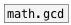

[<<< reference home](ceammc_lib.md)
---

# math.lcm

```


[F]  [F]
|    |.
[flow.sync 2] [3 5(
|    ^|.      |
[math.lcm   12]
|
[F]

            
```
---
calculate least common multiple
---
arguments:

ARG2: second argument<br>

---
properties:


---
see also:<br>
[](math.gcd.md)
