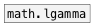
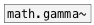

# math.lgamma~

```


[bang(
|
[plot.linspace~ -4 5 400 #a]
|
[math.lgamma~]
|
[ui.plot~ @xlabels 1 @ylabels 1 @ymin -5 @ymax 10 @size 400 170 #b]


[ui.dsp~]
[X a:1->b:1]

            
```
---
arguments:


---
properties:


see also:<br>


