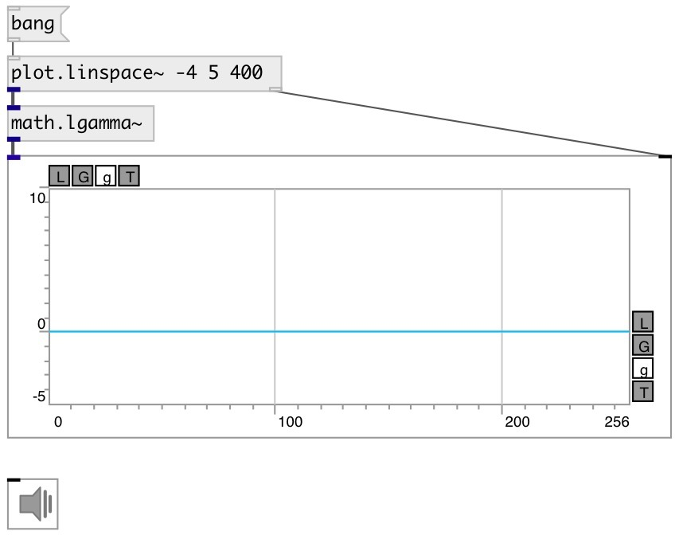

[index](index.html) :: [math](category_math.html)
---

# math.lgamma~

###### natural logarithm of the absolute value of the gamma function for
            signals

*available since version:* 0.9

---

## inlets:

* input signal 
__type:__ audio 

## outlets:

* output signal
__type:__ audio 

## keywords:

[math](keywords/math.html)
[log](keywords/log.html)
[gamma](keywords/gamma.html)
[factorial](keywords/factorial.html)

**See also:**
[\[math.lgamma\]](math.lgamma.html)
[\[math.gamma~\]](math.gamma~.html)

**Authors:** Serge Poltavsky

**License:** GPL3 or later

