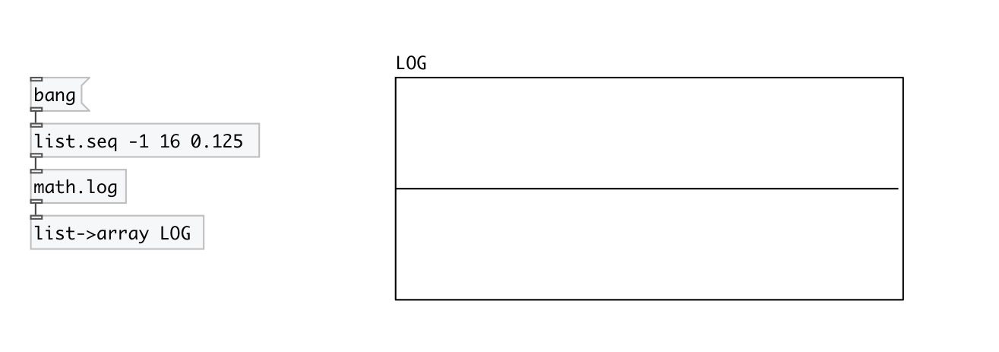

[< reference home](index.html)
---

# math.log

natural logarithm

---

Computes the value of the natural logarithm of argument x.
Special values:
log(+-0) return -infinity
log(1) return +0.
log(x) return a NaN
log(+infinity) return +infinity.
 

---

---
arguments:

---
properties:

---
see also: 

