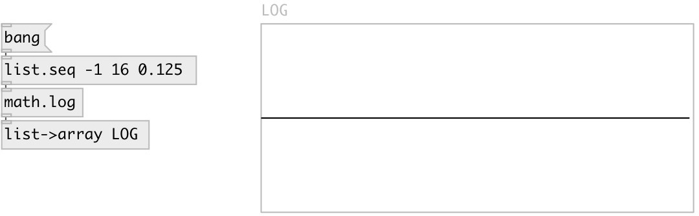

[index](index.html) :: [math](category_math.html)
---

# math.log

###### natural logarithm

*available since version:* 0.1

---

## information
Computes the value of the natural logarithm of argument x. Special values: log(+-0) return -infinity log(1) return +0. log(x) return a NaN log(+infinity) return +infinity.

## inlets:

* input value 
_type:_ control

## outlets:

* result value 
_type:_ control

## keywords:

[math](keywords/math.html)
[log](keywords/log.html)

**See also:**
[\[math.exp\]](math.exp.html)

**Authors:** Serge Poltavsky

**License:** GPL3 or later

