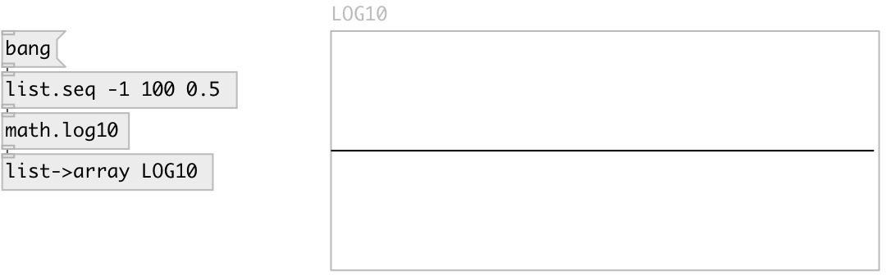

[index](index.html) :: [math](category_math.html)
---

# math.log10

###### logarithm functions

*available since version:* 0.1

---

## information
The log10() function computes the value of the logarithm of argument x to base
            10.
Special values:
log10(+-0) return -infinity
log10(1) return +0.
log10(x) return a NaN
log10(+infinity) return +infinity.

## inlets:

* input value 
_type:_ control

## outlets:

* result value 
_type:_ control

## keywords:

[math](keywords/math.html)
[log10](keywords/log10.html)

**See also:**
[\[math.exp\]](math.exp.html)

**Authors:** Serge Poltavsky

**License:** GPL3 or later

