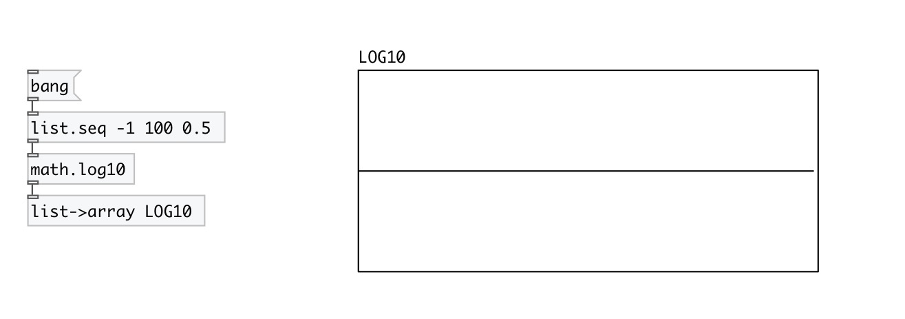

[< reference home](index.html)
---

# math.log10

logarithm functions

---

The log10() function computes the value of the logarithm of argument x to base
            10.
Special values:
log10(+-0) return -infinity
log10(1) return +0.
log10(x) return a NaN
log10(+infinity) return +infinity.
 

---

---
arguments:

---
properties:

---
see also: 

