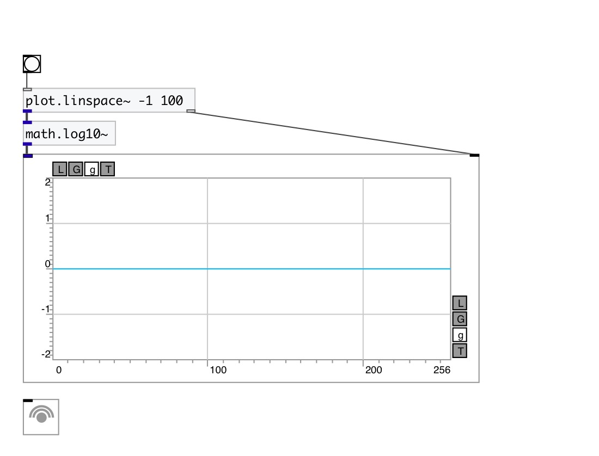

[< reference home](index.html)
---

# math.log10~

natural logarithm

---

Outputs the value of the base-10 logarithm
Special values:
log10(1) return +0.
log10(+infinity) return +infinity.
 

---

---
arguments:

---
properties:

---
see also: 

