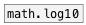

[<<< reference home](ceammc_lib.md)
---

# math.log10~

```


[B]
|
[plot.linspace~ -1 100]
|                 ^|
[math.log10~]      |
|                  |.
[ui.plot~ @xlabels 1 @ylabels 1 @ymin -2 @ymax 2 @size 400 200]


[ui.dsp~]

            
```
---
natural logarithm
---
arguments:


---
properties:


---
see also:<br>
[](math.log10.md)
