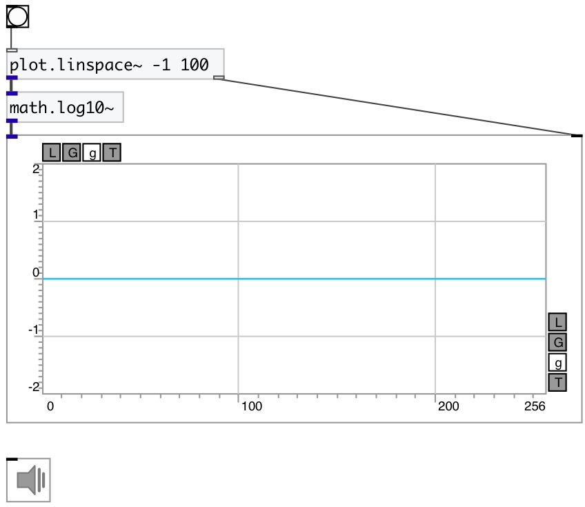

[index](index.html) :: [math](category_math.html)
---

# math.log10~

###### natural logarithm

*available since version:* 0.9

---

## information
Outputs the value of the base-10 logarithm
Special values:
log10(1) return +0.
log10(+infinity) return +infinity.

## inlets:

* input signal 
_type:_ audio

## outlets:

* result signal 
_type:_ audio

## keywords:

[math](keywords/math.html)
[log10](keywords/log10.html)

**See also:**
[\[math.log10\]](math.log10.html)

**Authors:** Serge Poltavsky

**License:** GPL3 or later

