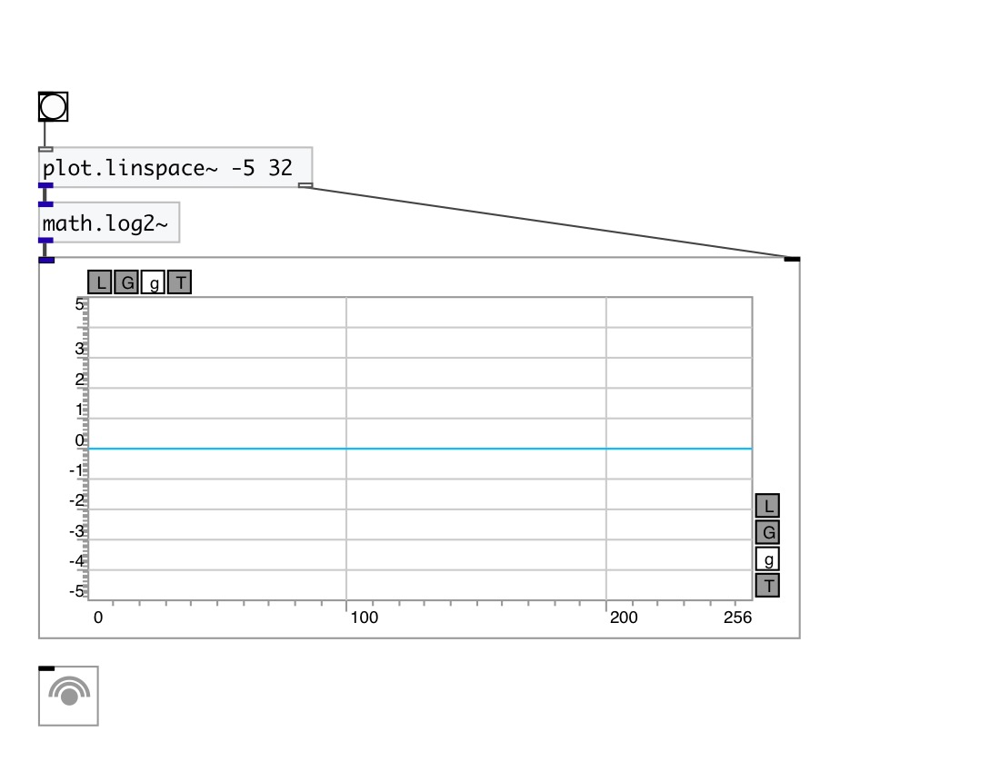

[< reference home](index.html)
---

# math.log2~

base-2 logarithm

---

Outputs the value of the logarithm of argument x to base 2
Special values:
log2(1) return +0.
log2(+infinity) return +infinity.
 

---

---
arguments:

---
properties:

---
see also: 

