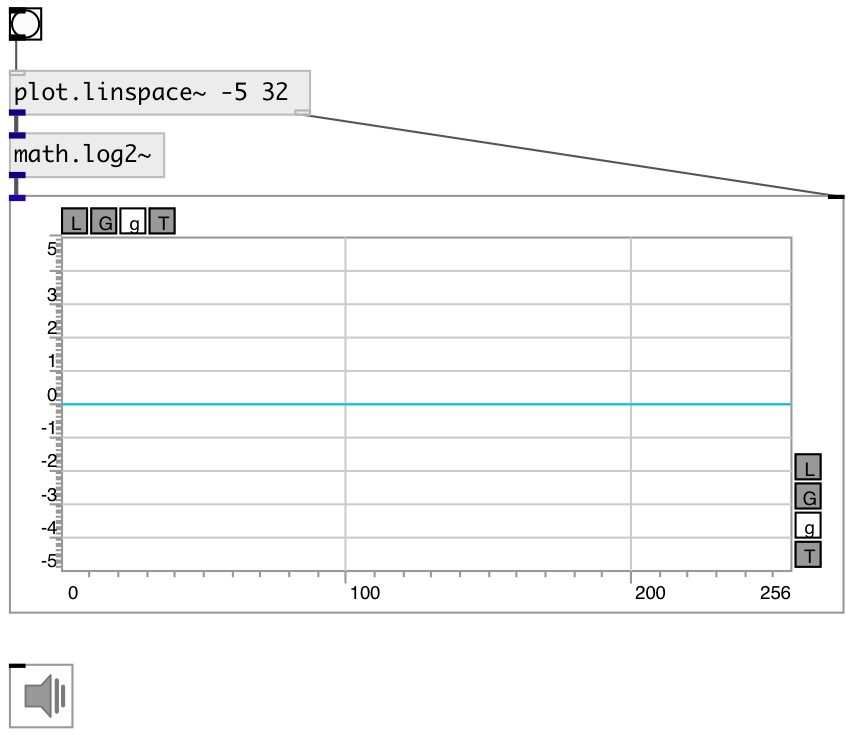

[index](index.html) :: [math](category_math.html)
---

# math.log2~

###### base-2 logarithm

*available since version:* 0.9

---

## information
Outputs the value of the logarithm of argument x to base 2
Special values:
log2(1) return +0.
log2(+infinity) return +infinity.

## inlets:

* input signal 
_type:_ audio

## outlets:

* result signal 
_type:_ audio

## keywords:

[math](keywords/math.html)
[log2](keywords/log2.html)

**See also:**
[\[math.exp2~\]](math.exp2~.html)
[\[math.log2\]](math.log2.html)

**Authors:** Serge Poltavsky

**License:** GPL3 or later

