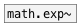

[< reference home](ceammc_lib.html)
---

# math.log~


natural logarithm

---

Outputs the value of the natural logarithm
Special values:
log(1) return +0.
log(+infinity) return +infinity.
<br>


---


```


[B]
|
[plot.linspace~ -4 30]
|                 ^|
[math.log~]        |
|                  |.
[ui.plot~ @xlabels 1 @ylabels 1 @ymin -5 @ymax 5 @size 400 200]


[ui.dsp~]

            
```

---
arguments:


---
properties:


---
see also:<br>
[](math.exp~.html)
[](math.log2.html)
