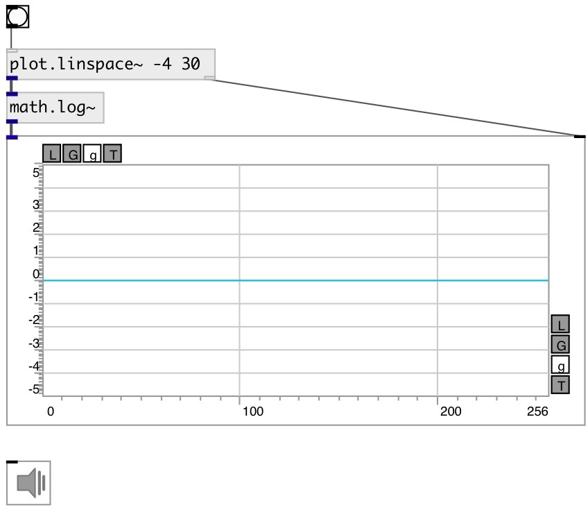

[index](index.html) :: [math](category_math.html)
---

# math.log~

###### natural logarithm

*available since version:* 0.9

---

## information
Outputs the value of the natural logarithm
Special values:
log(1) return +0.
log(+infinity) return +infinity.

## inlets:

* input signal 
__type:__ audio 

## outlets:

* result signal
__type:__ audio 

## keywords:

[math](keywords/math.html)
[log](keywords/log.html)

**See also:**
[\[math.exp~\]](math.exp~.html)
[\[math.log2\]](math.log2.html)

**Authors:** Serge Poltavsky

**License:** GPL3 or later

