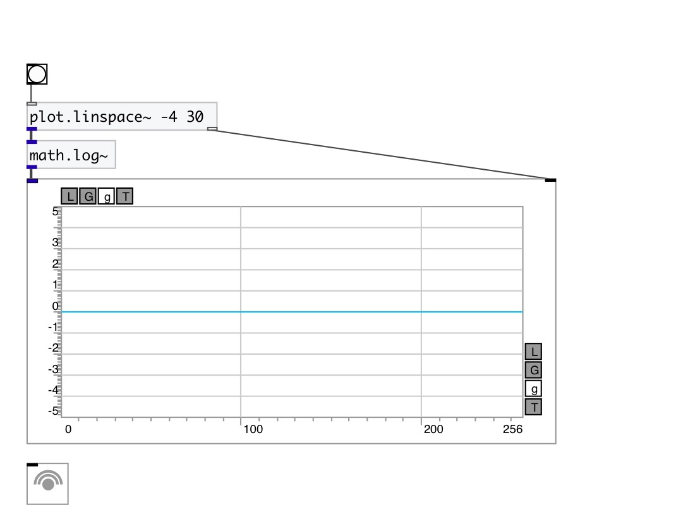

[< reference home](index.html)
---

# math.log~

natural logarithm

---

Outputs the value of the natural logarithm
Special values:
log(1) return +0.
log(+infinity) return +infinity.
 

---

---
arguments:

---
properties:

---
see also: 

