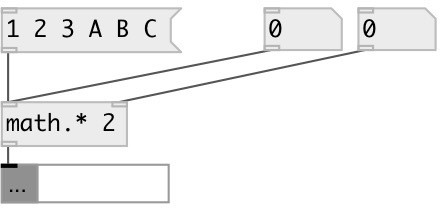

[index](index.html) :: [math](category_math.html)
---

# math.mul

###### multiplication (on lists too)

*available since version:* 0.6

---

## arguments:

* **MUL**
multiplicand 
__type:__ float 

## properties:

* **@mul** 
Get/set multiplicand 
__type:__ float 
__default:__ 1 

## inlets:

* multiplier 
__type:__ control 
* change multiplicand 
__type:__ control 

## outlets:

* float or list
__type:__ control 

## keywords:

[math](keywords/math.html)
[mul](keywords/mul.html)

**Authors:** Serge Poltavsky

**License:** GPL3 or later

