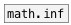

[<<< reference home](ceammc_lib.md)
---

# math.nan

```


[B]
|
[math.nan]
|
[floatatom]

            
```
---
Not a Number, unrepresentable value
---
arguments:


---
properties:


---
see also:<br>
[](math.inf.md)
