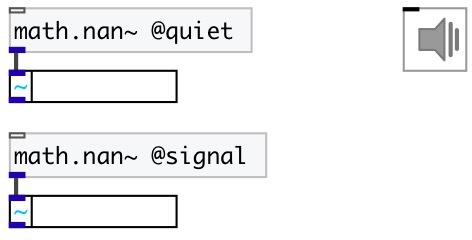

[index](index.html) :: [math](category_math.html)
---

# math.nan~

###### signal NaN

*available since version:* 0.9.1

---

## information
In computing, NaN, standing for not a number, is a numeric data type value representing an undefined or unrepresentable value, especially in floating-point calculations. Systematic use of NaNs was introduced by the IEEE 754 floating-point standard in 1985, along with the representation of other non-finite quantities like infinities. When an operation results in a quiet NaN, there is no indication that anything is unusual until the program checks the result and sees a NaN. That is, computation continues without any signal from the floating point unit (FPU) or library if floating-point is implemented in software. A signalling NaN will produce a signal, usually in the form of exception from the FPU. Whether the exception is thrown depends on the state of the FPU. Note: in Pd float point exceptions are disabled.

## properties:

* **@type** 
Get/set type of outputed NaN: quiet or signal 
_type:_ symbol 
_enum:_ quiet, signal 
_default:_ quiet 

* **@quiet** 
Get/set alias to @type quiet 
_type:_ alias 

* **@signal** 
Get/set alias to @type signal 
_type:_ alias 

## inlets:

* control input 
_type:_ control

## outlets:

* output 
_type:_ audio

## keywords:

[math](keywords/math.html)
[nan](keywords/nan.html)

**See also:**
[\[math.nan\]](math.nan.html)
[\[math.inf~\]](math.inf~.html)

**Authors:** Serge Poltavsky

**License:** GPL3 or later

