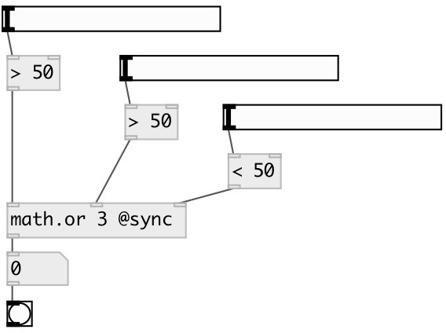

[index](index.html) :: [math](category_math.html)
---

# math.or
**aliases:** [ceammc/or], [or]

###### operation OR for multiple arguments

*available since version:* 0.2

---

## arguments:

* **NUM**
number of arguments 
_type:_ int 

## methods:

* **reset**
resets all input states to false 

## properties:

* **@sync** 
Get/set if specified - all inlets are &#39;hot&#39; 
_type:_ int 
_enum:_ 0, 1 
_default:_ 0 

* **@state** (readonly)
Get internal logic state as list of 1 and 0 
_type:_ list 
_default:_ 0 0 0 

## inlets:

* 1 or 0 
_type:_ control
* 1 or 0 
_type:_ control
* 1 or 0 
_type:_ control

## outlets:

* 1 - if all input values are true (1), 0 - otherwise 
_type:_ control

## keywords:

[math](keywords/math.html)
[or](keywords/or.html)
[logic](keywords/logic.html)

**See also:**
[\[math.and\]](math.and.html)

**Authors:** Serge Poltavsky

**License:** GPL3 or later

