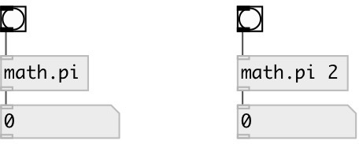

[index](index.html) :: [math](category_math.html)
---

# math.pi

###### mathematical constant

*available since version:* 0.1

---

## information
The number PI is a mathematical constant, the ratio of a circle&#39;s circumference to its diameter, commonly approximated as 3.14159.

## arguments:

* **MUL**
multiplier. default is 1 
_type:_ float 

## properties:

* **@k** 
Get/set multiplier 
_type:_ float 
_default:_ 1 

## inlets:

* outputs value 
_type:_ control

## outlets:

* output value 
_type:_ control

## keywords:

[math](keywords/math.html)
[pi](keywords/pi.html)

**See also:**
[\[math.e\]](math.e.html)
[\[math.pi~\]](math.pi~.html)

**Authors:** Serge Poltavsky

**License:** GPL3 or later

