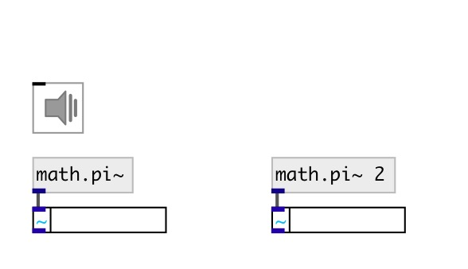

[index](index.html) :: [math](category_math.html)
---

# math.pi~
**aliases:** [ceammc/pi\~], [pi\~]

###### mathematical constant

*available since version:* 0.9

---

## information
The number PI is a mathematical constant, the ratio of a circle&#39;s circumference to its diameter, commonly approximated as 3.14159.

## arguments:

* **K**
multiplier. default is 1 
_type:_ float 

## properties:

* **@k** (initonly)
Get/set multiplier 
_type:_ float 
_default:_ 1 

## outlets:

* output value 
_type:_ audio

## keywords:

[math](keywords/math.html)
[pi](keywords/pi.html)

**See also:**
[\[math.pi\]](math.pi.html)

**Authors:** Serge Poltavsky

**License:** GPL3 or later

