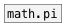

[< reference home](ceammc_lib.html)
---

# math.pi~


mathematical constant

---

The number PI is a mathematical constant, the ratio of a circle&#39;s circumference to
            its diameter, commonly approximated as 3.14159.<br>


---


```


[ui.dsp~]


[math.pi~]      [math.pi~ 2]
|               |
[ui.n~]         [ui.n~]

            
```

---
arguments:

MUL: multiplier. default is 1<br>

---
properties:


---
see also:<br>
[](math.pi.html)
