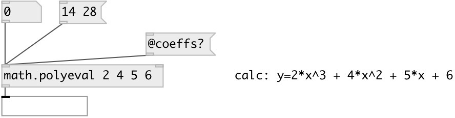

[index](index.html) :: [math](category_math.html)
---

# math.polyeval

###### evaluates the polynomial described by the coefficients list

*available since version:* 0.6

---

## arguments:

* **ARGS**
coefficient list 
_type:_ float 

## properties:

* **@coeffs** 
Get/set coefficient list 
_type:_ list 

## inlets:

* evalute polynomial 
_type:_ control
* sets polynomial coefficients 
_type:_ control

## outlets:

* calculated value 
_type:_ control

## keywords:

[math](keywords/math.html)
[polynomial](keywords/polynomial.html)

**Authors:** Serge Poltavsky

**License:** GPL3 or later

