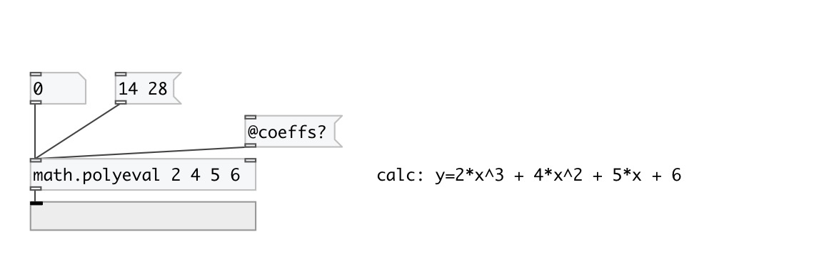

[< reference home](index.html)
---

# math.polyeval

evaluates the polynomial described by the coefficients list

---

 

---

---
arguments:

ARGS: coefficient list 

---
properties:

@coeffs: coefficient list 

