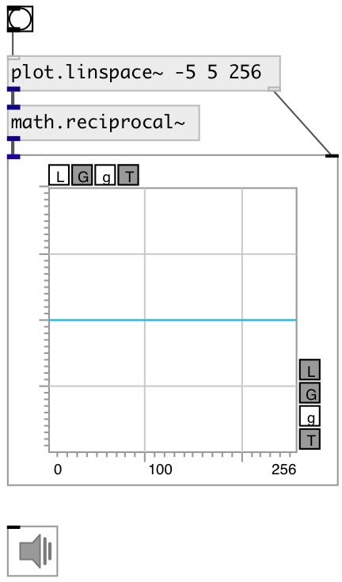

[index](index.html) :: [math](category_math.html)
---

# math.reciprocal~
**aliases:** [ceammc/1/x\~], [1/x\~]

###### calculate reciprocal number for signals

*available since version:* 0.9

---

## inlets:

* input signal 
_type:_ audio

## outlets:

* output signal 
_type:_ audio

## keywords:

[math](keywords/math.html)
[reciprocal](keywords/reciprocal.html)

**Authors:** Serge Poltavsky

**License:** GPL3 or later

