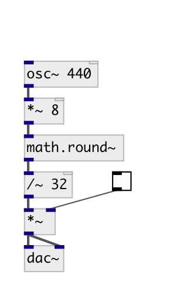

[index](index.html) :: [math](category_math.html)
---

# math.round~
**aliases:** [round\~], [ceammc/round\~]

###### signal round

*available since version:* 0.4

---

## inlets:

* input signal 
_type:_ audio

## outlets:

* output rounded signal 
_type:_ audio

## keywords:

[math](keywords/math.html)
[round~](keywords/round~.html)

**See also:**
[\[math.round\]](math.round.html)

**Authors:** Serge Poltavsky

**License:** GPL3 or later

