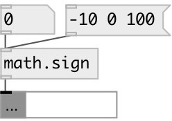

[index](index.html) :: [math](category_math.html)
---

# math.sign

###### sign function

*available since version:* 0.1

---

## information
Returns *-1* if x 0.

## inlets:

* input value 
_type:_ control

## outlets:

* result value 
_type:_ control

## keywords:

[math](keywords/math.html)
[sign](keywords/sign.html)

**Authors:** Serge Poltavsky

**License:** GPL3 or later

