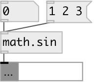

[index](index.html) :: [math](category_math.html)
---

# math.sin

###### sine function

*available since version:* 0.1

---

## information
The sin() function computes the sine of input value (measured in radians). Special values: sin(+-0) returns +-0. sin(+-infinity) returns a NaN.

## inlets:

* input value 
_type:_ control

## outlets:

* result value 
_type:_ control

## keywords:

[math](keywords/math.html)
[sin](keywords/sin.html)

**See also:**
[\[math.acos\]](math.acos.html)
[\[math.asin\]](math.asin.html)
[\[math.atan\]](math.atan.html)

**Authors:** Serge Poltavsky

**License:** GPL3 or later

