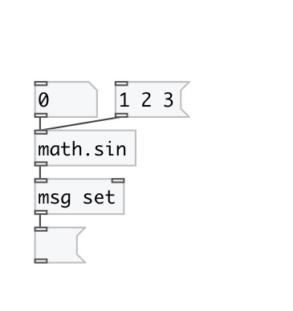

[< reference home](index.html)
---

# math.sin

sine function

---

The sin() function computes the sine of input value (measured in radians).
Special values:
sin(+-0) returns +-0.
sin(+-infinity) returns a NaN.
 

---

---
arguments:

---
properties:

---
see also: 

