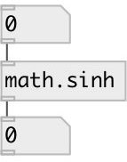

[index](index.html) :: [math](category_math.html)
---

# math.sinh

###### hyperbolic sine function

*available since version:* 0.1

---

## information
The sinh() function computes the hyperbolic sine of x. Special values: sinh(+-0) returns +-0. sinh(+-infinity) returns +-infinity.

## inlets:

* input value 
_type:_ control

## outlets:

* result value 
_type:_ control

## keywords:

[math](keywords/math.html)
[sinh](keywords/sinh.html)

**See also:**
[\[math.acos\]](math.acos.html)
[\[math.asin\]](math.asin.html)
[\[math.atan\]](math.atan.html)

**Authors:** Serge Poltavsky

**License:** GPL3 or later

