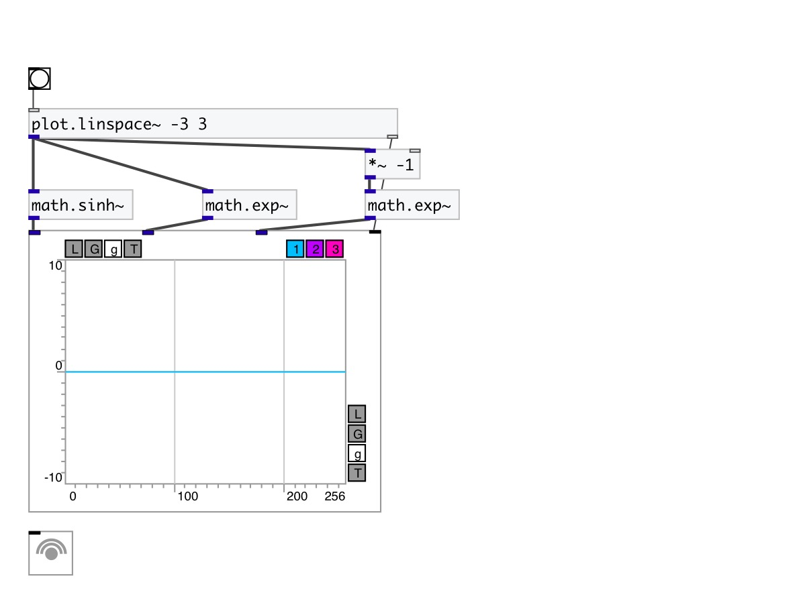

[< reference home](index.html)
---

# math.sinh~

hyperbolic sine for signals

---

Outputs hyperbolic sine of input signal
sinh x = (ℯˣ - ℯ⁻ˣ)/2
 

---

---
arguments:

---
properties:

---
see also: 

