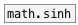

[<<< reference home](ceammc_lib.md)
---

# math.sinh~

```


[B]
|
[plot.linspace~ -3 3  {w=37} #a]
|            |           |
|            |           [*~ -1]
|            |           |
[math.sinh~] [math.exp~] [math.exp~]
|            |.          |..
[ui.plot~ @xlabels 1 @ylabels 1 @ymin -10 @ymax 10 @size 250 200 @n 3 #b]


[ui.dsp~]
[X a:1->b:3]

            
```
---
hyperbolic sine for signals
---
arguments:


---
properties:


---
see also:<br>
[](math.asinh~.md)
[](math.sinh.md)
