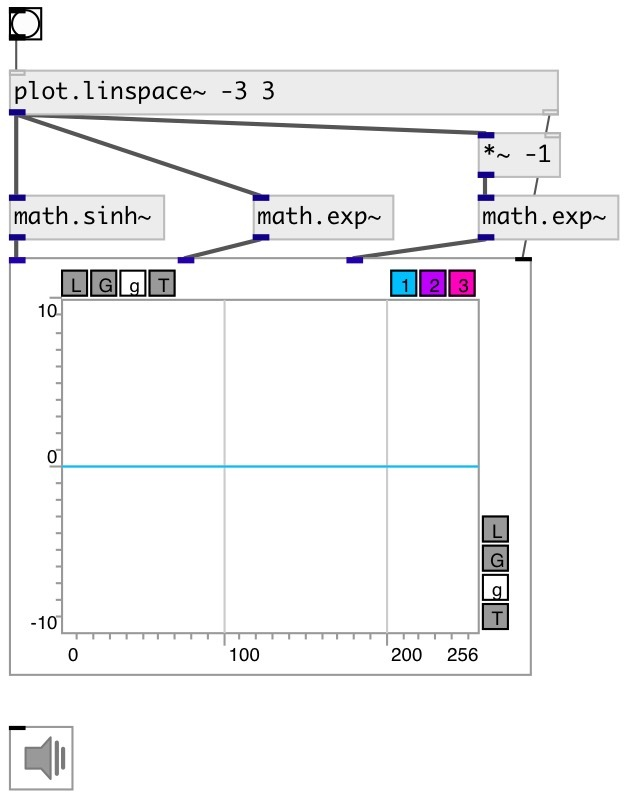

[index](index.html) :: [math](category_math.html)
---

# math.sinh~

###### hyperbolic sine for signals

*available since version:* 0.9

---

## information
Outputs hyperbolic sine of input signal sinh x = (ℯˣ - ℯ⁻ˣ)/2

## inlets:

* input signal 
_type:_ audio

## outlets:

* result signal 
_type:_ audio

## keywords:

[math](keywords/math.html)
[hyperbolic](keywords/hyperbolic.html)
[arc](keywords/arc.html)
[sine](keywords/sine.html)

**See also:**
[\[math.asinh~\]](math.asinh~.html)
[\[math.sinh\]](math.sinh.html)

**Authors:** Serge Poltavsky

**License:** GPL3 or later

