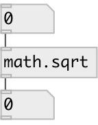

[index](index.html) :: [math](category_math.html)
---

# math.sqrt

###### square root function

*available since version:* 0.1

---

## information
The sqrt() function compute the non-negative square root of x.
Special values:
sqrt(-0) returns -0.
sqrt(x) returns a NaN and generates a domain error for x &lt; 0.

## inlets:

* input value 
__type:__ control 

## outlets:

* result value
__type:__ control 

## keywords:

[math](keywords/math.html)
[sqrt](keywords/sqrt.html)

**Authors:** Serge Poltavsky

**License:** GPL3 or later

