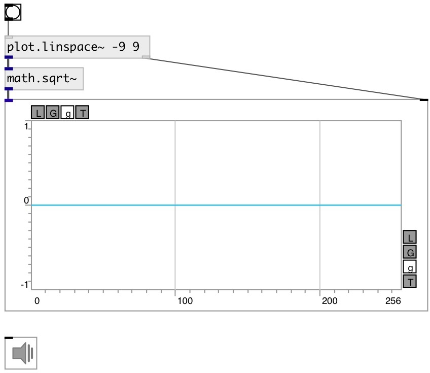

[index](index.html) :: [math](category_math.html)
---

# math.sqrt~

###### square root for signal

*available since version:* 0.9

---

## information
outputs NAN if input signal &lt;0

## inlets:

* input signal 
_type:_ audio

## outlets:

* output signal 
_type:_ audio

## keywords:

[math](keywords/math.html)
[exp2](keywords/exp2.html)

**See also:**
[\[math.squared~\]](math.squared~.html)
[\[math.sqrt\]](math.sqrt.html)

**Authors:** Serge Poltavsky

**License:** GPL3 or later

