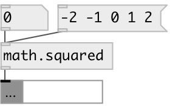

[index](index.html) :: [math](category_math.html)
---

# math.squared

###### value square

*available since version:* 0.1

---

## inlets:

* input value 
__type:__ control 

## outlets:

* result
__type:__ control 

## keywords:

[math](keywords/math.html)
[square](keywords/square.html)

**Authors:** Serge Poltavsky

**License:** GPL3 or later

